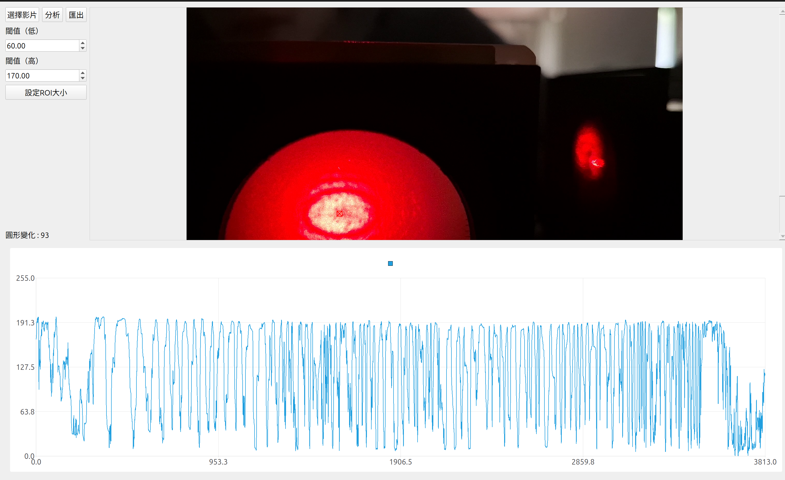

# Michelson Interferometer
在成大的普物實驗中，有一個有關麥克森干涉移的實驗（至少電機系有）。  
其中有一個是要測玻璃折射率，實驗中要數90多圈的光圈變化，~~數到眼睛快脫窗~~。有嘗試用Tracker分析，但是應該是因為他的功能太多，跑得很慢，界面也不好用，~~也可能是我沒讀說明書~~。  
因此我就自己寫了一個簡單的程式來分析這個實驗。避免學弟妹步上我的後塵。
## Feature
- 自動計算特定區域內的顏色隨著時間變化的圖形
- 速度比Tracker快，也不用數到眼睛脫窗
- 匯出成csv
- 自動數光圈變化
## Dependencies
- qt5
  ```bash
  sudo apt install libqt5charts5-dev qtbase5-dev qt5-qmake
  ```
- opencv
  ```bash
  sudo apt install libopencv-dev
  ```
## Install
  ```bash
  # 下載Repository
  git clone git@github.com:yushiuan9499/michelson-interfer.git
  # 移動到資料夾
  cd michelson-interfer
  # 編譯
  ./tools/build.sh
  ```
## Usage
1. 執行檔案
  ```bash
  # 進入資料夾
  cd michelson-interfer
  # 執行
  ./bin/main
  ```
2. 選擇影片
3. 按下shift+左鍵，選擇要分析的區域
4. 按下「分析」按鈕
## Screenshot


## 備註
目前已經在windows 11和ubuntu 24.04上測試過。  
windows的安裝方法還在研究中。
